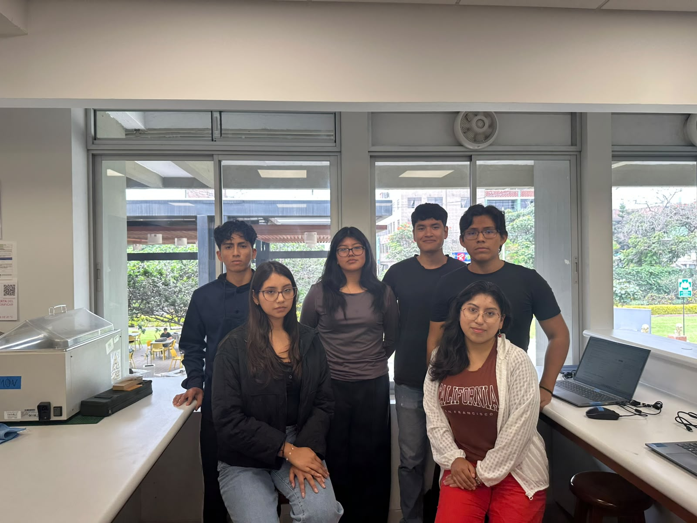
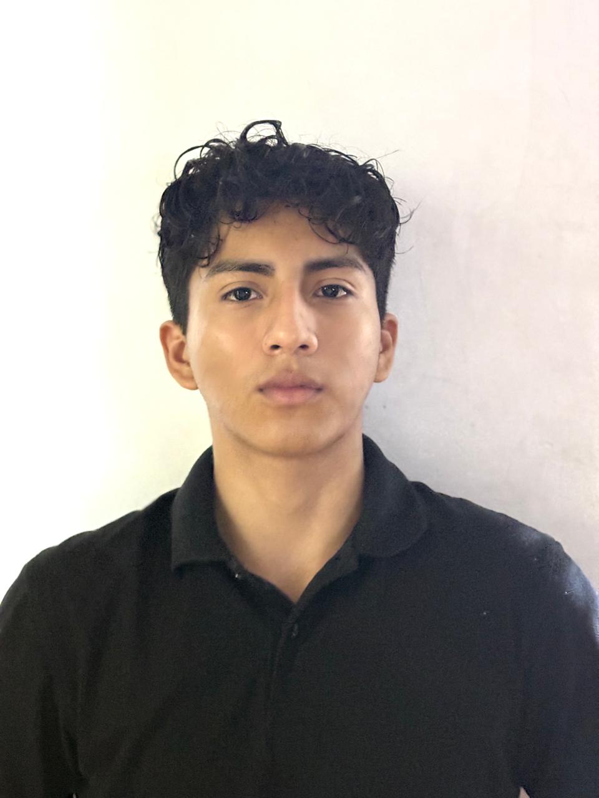
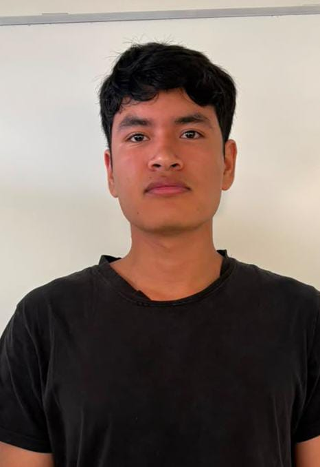
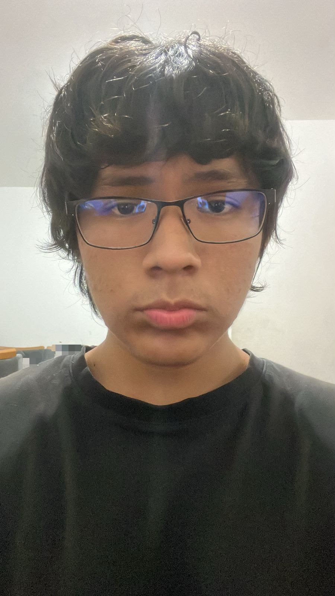
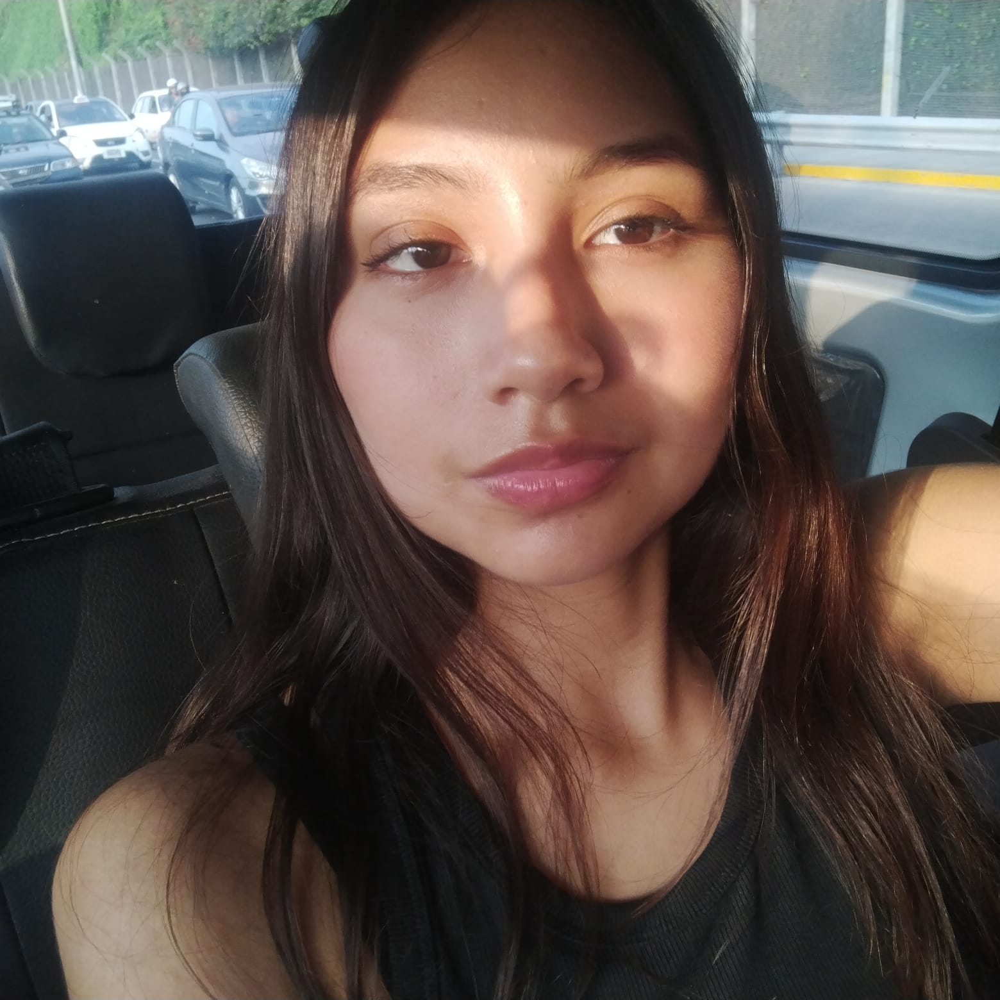
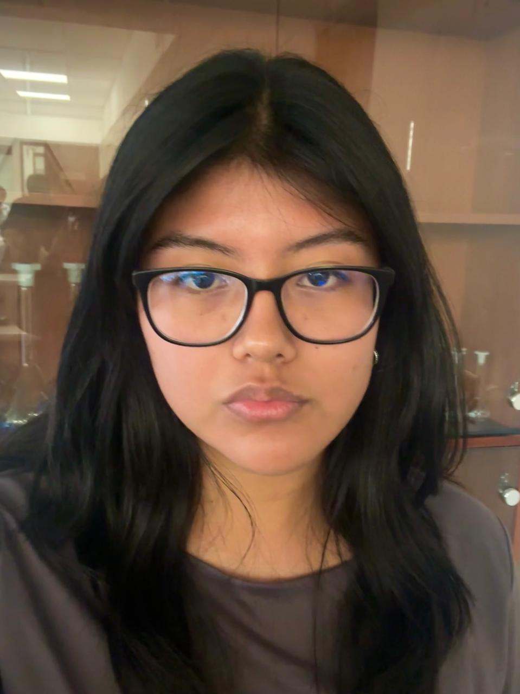
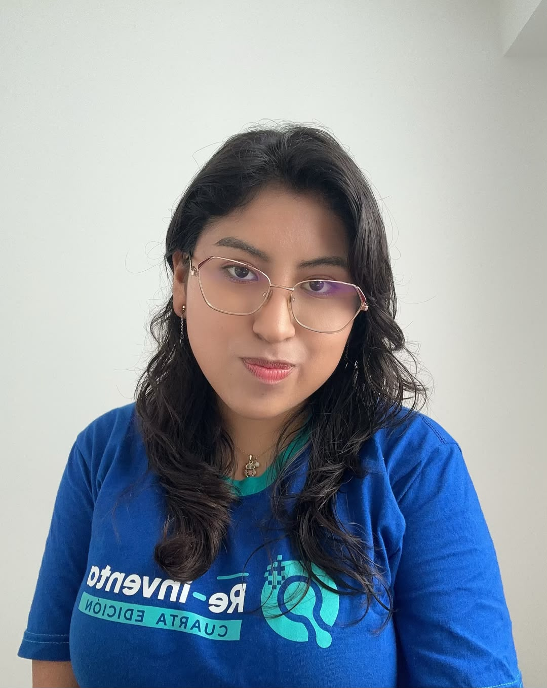

# Equipo 13 - Fundamentos de Biodiseño
### Carrera de Ingeniería Biomédica
**Universidad Peruana Cayetano Heredia**
## 🌎Descripción del Equipo
Somos el Equipo 13 del curso Fundamentos de Biodiseño, conformado por estudiantes de Ingeniería Biomédica PUCP-UPCH.

Nuestro objetivo es aplicar los conocimientos de ingeniería en soluciones innovadoras para resolver problemas de salud a nivel nacional y mundial
Nos interesa trabajar en los siguientes Objetivos de Desarrollo Sostenible (ODS):

ODS 3: Salud y Bienestar  
ODS 6: Agua Limpia y Saneamiento  
ODS 9: Industria, Innovación e Infraestructura  
ODS 11: Ciudades y Comunidades Sostenibles  
ODS 13: Acción por el Clima  

## 📸Fotografía del Equipo

  <em>Figura 1. Fotografía del equipo 13</em>

---
## 👥Integrantes del Equipo

| Foto | Nombre | Rol | Intereses |
|------|--------|-----|-----------|
|  | **Livia Alvarez, Carlos Felipe** | Líder del equipo | Innovación social, sostenibilidad |
|  | **Mendizabal Soto, Alvaro Martin** | Responsable de investigación | Gestión ambiental, desarrollo comunitario |
|  | **Ollero Poma, Franco Esteban** | Diseñador | Diseño de prototipos, creatividad aplicada |
|  | **Peña Zuñiga, Daniela Nicoll** | Encargada de documentación | Comunicación científica, redacción técnica |
|  | **Quispe Solano, Anghely Lucia** | Programadora - Modeladora | Programación, análisis de datos, simulación |
|  | **Rojas Salazar, Fathyma Ennidh** | Programadora - Modeladora | Programación, análisis de datos, simulación | 
---

## 📌Resumen

En este README presentamos quiénes somos como equipo, nuestras principales motivaciones y el ODS en el que enfocaremos nuestro trabajo durante el curso.
